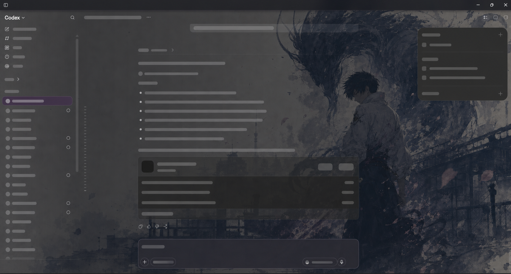

# Codex 落樱完整版 · Windows

将落樱壁纸、原版开场动画、Wallpaper Engine 本地媒体和统一外观设置整合到 Windows 官方 Codex / ChatGPT Work 桌面应用。

**维护与 Windows 整合：[qiye001](https://github.com/qiye001)。非 OpenAI 官方产品。** 上游代码、动画、图片和运行时分别保留原作者与许可，详见 [作者与来源](docs/ATTRIBUTION.md) 和 [许可范围](NOTICE.md)。

## 普通用户：下载、解压、双击

1. 先安装 Microsoft Store 官方 Codex，并正常登录一次。
2. 从 [Releases](https://github.com/qiye001/codex-sakura-full/releases) 下载 `codex-sakura-full-v1.0.0-windows-x64.zip`；源码 ZIP 不含便携 Node，普通用户应下载 Release 安装包。
3. **完整解压**到本地文件夹；不要在压缩包内运行，也不要只复制一个安装文件。
4. 双击 **Install.cmd**。安装器会检查包完整性、安装外观引擎和技能、生成桌面 **Codex** 图标及开始菜单 **Codex Sakura → Codex** 入口。
5. 如果 Codex 正在普通模式运行，保存未发送内容并从应用菜单**退出整个应用**，再双击新桌面 **Codex** 图标。只关闭窗口可能仍留有后台进程；安装器不会强制结束你的应用。
6. 首次冷启动加载壁纸并播放约 12 秒开场，可按 Esc 或点击跳过。已有外观会话再次点击图标只唤起窗口。

**日常只需双击桌面 Codex 图标，无需反复运行安装器，也不需要另外打开壁纸管理软件。**

Windows 10/11 x64；Release 包附带 Node.js 24.16.0，不需全局安装 Node。官方应用需要先安装并注册到当前 Windows 用户。Linux、macOS、Windows ARM64 不属于此安装包的验证范围。



上图为上游随包提供的示例截图，实际按钮与当前整合版可能不同。

## 能做什么

| 功能 | 入口与用法 |
|---|---|
| 主壁纸 | 左侧图片图标，悬浮提示“壁纸”；打开统一设置的“壁纸”页签 |
| 图片和视频 | 上传 PNG、JPEG、WebP、GIF、BMP、AVIF、MP4、WebM，单个文件上限 128 MB；具体编码取决于 Chromium 解码能力 |
| 显示方式 | 按比例铺满、完整显示、原始尺寸、拉伸和对齐；铺满可能裁边，完整显示可能留白 |
| Wallpaper Engine | 从本机 Steam 库发现原视频与可可靠读取的单底图场景；不会下载、运行或完整复现所有 Workshop 壁纸 |
| 原版启动动画 | “启动动画”页签，编辑两张图片、标题、小字、字幕与字体样式，保存并预览 |
| 快捷键 | Ctrl + Alt + B 打开动画设置；Esc 跳过开场或关闭当前设置菜单 |
| 还原默认 | 壁纸与动画各自恢复默认；两者独立保存，修改一个不会覆盖另一个 |
| 还原官方外观 | 运行 `Uninstall.ps1 -RestoreOnly`；正常退出后从官方入口启动可结束调试连接 |

GIF 在图库中可以显示静态缩略图；实际大背景读取原媒体。视频推荐使用常见 H.264 MP4 或 WebM。失败的媒体不会替换当前壁纸。

Wallpaper Engine 的复杂多层合成、Spine、网页、声音响应、粒子和时钟效果不会在 Codex 中完整复现。无法可靠取得底图的项目会隐藏；图片列表预览不代表可用的原始大背景。

## 完整说明与维护入口

- [详细使用说明](docs/USER_GUIDE.md)：安装、日常使用、壁纸、动画、本地图库、更新、数据位置、卸载。
- [故障排查](docs/TROUBLESHOOTING.md)：找不到路径、无壁纸、重复启动、登录、编码与日志。
- [开发与打包](docs/DEVELOPMENT.md)：源码结构、动画重建、验证、生成安装包。
- [作者与来源](docs/ATTRIBUTION.md)：直接上游、参考项目、固定提交和素材归属。
- [验证记录](docs/VALIDATION.md)：已实测项目、模拟场景及未验证边界。
- [安全说明](SECURITY.md)：仅本机 CDP 连接及恢复方式。
- [技能入口](SKILL.md)：供 Codex 安装、检查和维护此扩展。

### 常用检查命令

在完整解压的包目录中运行：

```powershell
# 检查文件完整性
powershell -NoProfile -ExecutionPolicy Bypass -File .\Verify.ps1 -FilesOnly

# 只检查电脑条件，不安装
powershell -NoProfile -ExecutionPolicy Bypass -File .\Install.ps1 -CheckOnly

# 检查已安装外观与实际连接
powershell -NoProfile -ExecutionPolicy Bypass -File .\scripts\diagnose.ps1

# 只恢复官方外观，保留设置和当前应用
powershell -NoProfile -ExecutionPolicy Bypass -File .\Uninstall.ps1 -RestoreOnly

# 移除运行引擎与本包桌面入口，保留账户、聊天和已保存选择
powershell -NoProfile -ExecutionPolicy Bypass -File .\Uninstall.ps1
```

`Install.cmd` 是安装入口；`README.md`、`SKILL.md` 是说明文件，不能作为程序启动。

## 数据、更新与限制

安装器不修改 WindowsApps、app.asar、官方登录资料或 API 配置。已保存的选择在重复安装时保留；旧引擎会备份到本机，不进入发布包。账户、聊天、个人上传媒体、Workshop 缓存和运行日志均不随仓库分发。

本扩展需要启动官方应用的本机调试连接。普通会话不能事后开启这一连接。官方更新可能改变窗口、DOM 或 CDP 能力；本项目不能保证未来版本无须适配，也不能保证官方账户永不要求重新登录。

## 许可与致谢

主要上游：

- [syiibfs-hash/ritual-ink-codex-theme-launcher](https://github.com/syiibfs-hash/ritual-ink-codex-theme-launcher)：Windows 落樱基础。
- [Fei-Away/Codex-Dream-Skin](https://github.com/Fei-Away/Codex-Dream-Skin)：更上游主题与渲染实现。
- [panding999/codex-startup-animation](https://github.com/panding999/codex-startup-animation)：原版启动动画。

软件 MIT 范围、动画授权、示例素材和 Node 第三方许可分别说明，**不把整包图片、商标和动画自动视为 MIT**。详见 [NOTICE.md](NOTICE.md)。